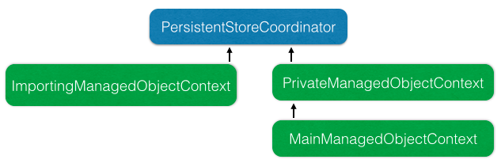

# insertObjectIntoContextFailure

Test project to demonstrate how we're using -[NSManagedObjectContext insertObject:],
and how it crashes and burns when trying to save if the context you inserted the
object into has a parent context. Independent contexts sharing a persistent store
coordinator appears to work fine.

## tl;dr;

Don't create NSManagedObjects and then insert them into a child NSManagedObjectContext.

## Rationale

We have a large import of fairly unstructured JSON data, and in order to
determine if we need to insert new objects or just update existing ones, we need
to partially create NSManagedObjects before inserting them.

This is done by passing nil to to the context parameter of
**-[NSManagedObject initWithEntity:insertIntoManagedObjectContext:]**.
(See **-[CDTPersistenceController insertString:intoContext:]** for an example.

Once the object is partially constructed, we can determine if it's required or not,
and then use **-[NSManagedObjectContext insertObject:]** to insert the object into
the object graph if we want to keep it. At that point we also connect any outstanding
relationships, etc.

## The Problem

This works great if the NSManagedObjectContext you are inserting into talks directly
to the persistent store coordinator.  However, if it is a child context of another
managed object context, the attributes of the new object do not get copied to the
parent context.  If the object has any validation of it's attributes (say, non-null for
example), the call to **-[NSManagedObject save:]** will fail.

## The Workaround

As I described earlier, writing to a new context that talks directly to the persistent
store coordinator, and then merging those changes in on the save notification works
as intended.

## The Demo

Build and run the project on a device or in the simulator.  Press _Insert into Standalone Context_
to operate the workaround, where we are inserting into a parallel managed object context.
This works great.  Press _Insert into Child/Main Context_ to demonstrate the bug and
abort() on the context saving.

